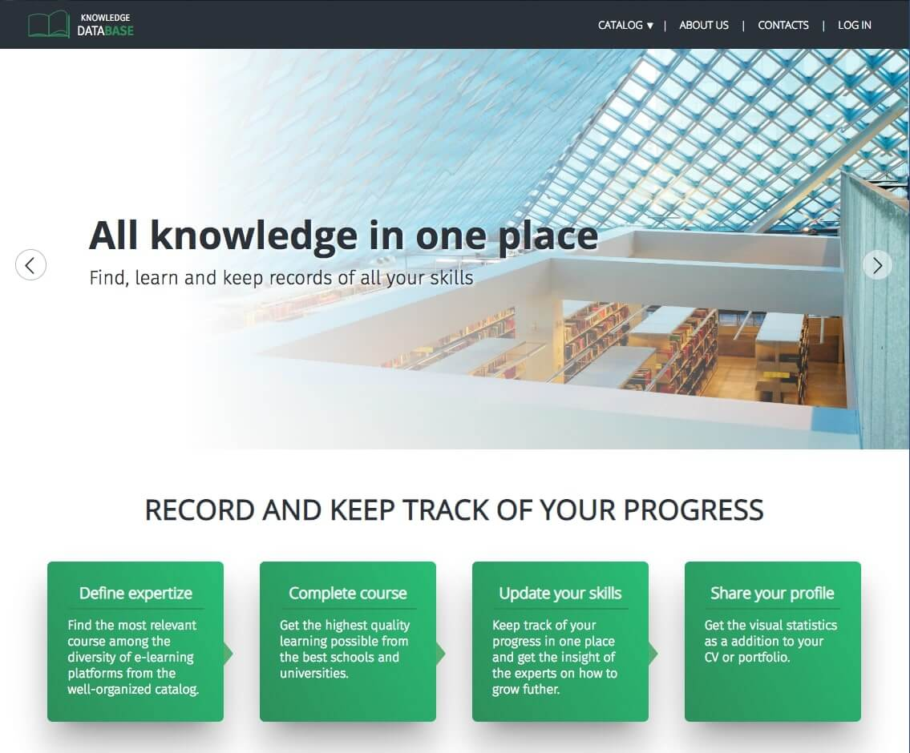
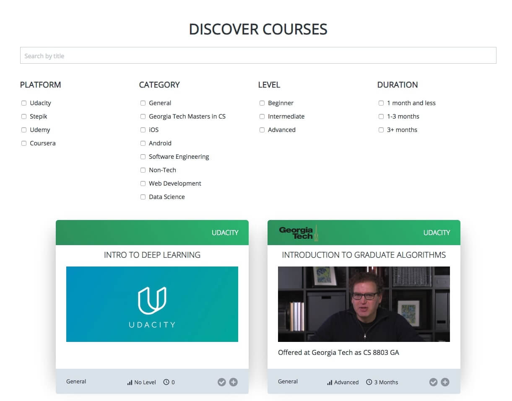

# Knowledge Register System



## Overview
The goal of this project is to gather all available courses from different educational platforms
and give an opportunity to manage all courses in one place.
The app is divided into 2 parts: public and private which is accessible only when the user is authorized.


As a part of public access, users can browse and search course by its name.
The user can filter courses by:
* platform
* category
* level
* duration
 


Once logged in, the user have ability to shelve courses according to their status:
* courses that currently in progress
* wish list
* completed courses

Based on the user's completed, his/her expterize in a certain field is calculated. 

### My thought on future improvements
* dropdown menu doesnt close when login opens - somehow control when clicked outside
* burger on small screen
* optimize so css files in each component (according with modular achitecture, isn't it?)
* remove fieldsets! it is used for radio buttons, and logic grouping, such as adress (street, code, etc)
* save data to local storage when user is not logged in
* remove slider from mobile version


## Deployment

## Requirements
You only need node.js pre-installed and you’re good to go.

To install package dependancies, run

```
npm install
```

This will create a directory node_modules .
Build the current application with command 

```
npm run dev
```
It runs on http://localhost:5000/
